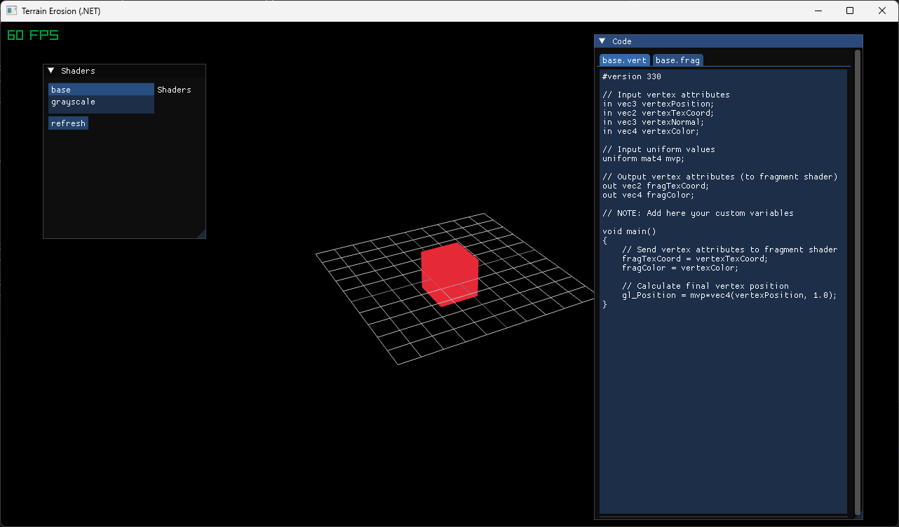

# rMaterialEditor

The goal is to create a way to edit, package and apply materials in RayLib-cs projects.

The first step is to create a shader editor. wip

## How to build and use

* Open and build rMaterialEditor.sln
* Tested with VS2022 (17.14.14)

## Structure of VS solution

* Library is the main project handling material packages
* Editor can be used to create or modify custom material packages
* ConsumerSampleApp shows how to integrate the library into your projects

## Main dependencies

* [Newtonsoft.Json](https://www.newtonsoft.com/json): for manipulation of json.
* [ImGui.NET](https://github.com/ImGuiNET/ImGui.NET): .NET wrapper for ImGui
* [Raylib-cs](https://github.com/raylib-cs/raylib-cs): C# bindings for raylib
* [rlImgui-cs](https://github.com/raylib-extras/rlImGui-cs): Glue to render ImGui using Raylib
* [NLog](https://github.com/NLog/NLog): NLog is a free logging platform for .NET

