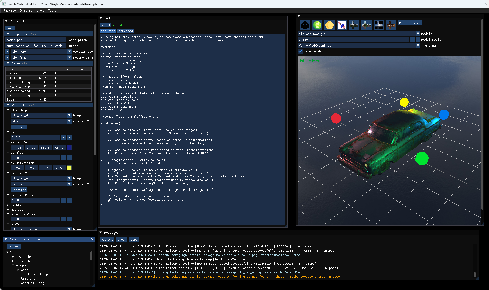
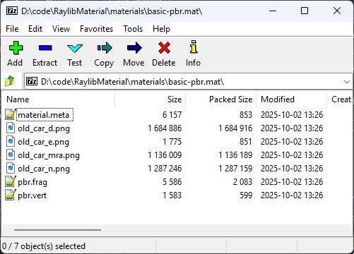

# RaylibMaterial

In Raylib, applying materials to models require numerous actions: load shaders, load images, set shader uniform values, apply shader to model...

The goal of this project is to simplify the applying materials to our models. For that purpose, I propose to generate "material packages" using an easy to use editor.
And then to apply such created packages to any of your models.

Such editor looks like:

The produce package are simple zip files that contains whatever is needed for Raylib:

It is based on RayLib-cs project.

## Status of the project

0.1 is still under developer. You can play with it and give feedbacks but the library and editor are not fully operational.

The remaining tasks for this first release are:
* [ ] support of models with multiple materials
* [ ] handle all kinds of uniform types (vec2, vec3...)
* [ ] preview material using a 3D model stored on disk (today only primitives are properly supported)
* [ ] use a sky box instead of a plane for background
* [ ] handle versioning of packages
* [ ] produce nuget package for library
* [ ] Cover 100% of code of the library with tests
* [ ] Add documentation of the editor and the library
* [ ] Improve existing sample and how to apply produced packages to your projects

## How to build and use

* Open and build RaylibMaterial.sln
* Tested with VS2022 (17.14.14)

## Structure of VS solution

* Library is the main project handling material 
* Library.Tests is the associated test project
* Editor can be used to create or modify custom material packages
* ConsumerSampleApp shows how to integrate the library into your projects

## Main dependencies

* [.NET 8](https://dotnet.microsoft.com/en-us/): cross-platform framework for building modern apps and powerful cloud services.
* [Newtonsoft.Json](https://www.newtonsoft.com/json): for manipulation of json.
* [ImGui.NET](https://github.com/ImGuiNET/ImGui.NET): .NET wrapper for ImGui
* [Raylib-cs](https://github.com/raylib-cs/raylib-cs): C# bindings for raylib
* [rlImgui-cs](https://github.com/raylib-extras/rlImGui-cs): Glue to render ImGui using Raylib
* [NLog](https://github.com/NLog/NLog): NLog is a free logging platform for .NET

Other ones:
* [ImGuiFileDialog](https://github.com/japajoe/ImGuiFileDialog): File dialog for ImGui.NET by japajoe
